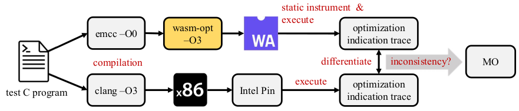

# Ditwo: Differential Testing framework for WebAssembly Optimizers
<!--- not compatible with anonymous git hub repo link
<p align="center">
  
</p>
<br />
--->


Artifact for ISSTA'23 paper "Exploring Missed Optimizations in WebAssembly Optimizers".

We aim to present the first systematic and in-depth understanding 
of the status quo of WebAssembly(wasm) optimizations with **Ditwo**, a 
**Di**fferential **T**esting framework to uncover *missed optimizations* (MO) 
of **W**asm **O**ptimizers. Ditwo compiles a C program into both native x86 
executable and wasm executable, and differentiates *optimization indication traces* 
(OITraces) logged by running each executable to uncover MO. Each OITrace 
is composed with global variable writes and function calls, two performance
indicators that practically and systematically reflect the optimization 
degree across wasm and native executables.

<!--- not compatible with anonymous git hub repo link
<p align="center">
  
</p>
<br />
--->


Ditwo is employed to test [`wasm-opt`](https://github.com/WebAssembly/binaryen#wasm-opt), the prevailing optimizer
maintained in the official wasm optimizer and compiler/toolchain library ([`Binaryen`](https://github.com/WebAssembly/binaryen)) and is extensively used by most wasm compilers (e.g., [AssemblyScript](https://github.com/AssemblyScript/assemblyscript), [Asterius](https://github.com/tweag/asterius), [Grain](https://github.com/grain-lang/grain)).
Note that we enable the `-O3` option and extra optimization passes to unleash the full optimization capability of `wasm-opt`. 
The list of employed optimization passes is: `"-O3 -g --mvp-features --converge --inlining-optimizing --local-cse --code-folding --licm --rse --precompute-propagate --optimize-added-constants-propagate"`

With 16K randomly generated C programs as test inputs, Ditwo
uncovers **1,293** inputs that result in under-optimized wasm 
programs. With about 140 man-hours, we manually diagnose the root
causes behind all exposed MO (see details in our paper). 
Moreover, with semi-manual study of five real-world applications, 
we estimate the lower bound of performance improvement, on 
average **17.15%**, after fixing the MO cases. The results indicate 
the severity of MO identified by Ditwo.

## Findings

Global varaible is not optimized: [https://github.com/WebAssembly/binaryen/issues/4947](https://github.com/WebAssembly/binaryen/issues/4947)  
Empty function is not inlined: [https://github.com/WebAssembly/binaryen/issues/4948](https://github.com/WebAssembly/binaryen/issues/4948)  
Optimizable loop is not optimized: [https://github.com/WebAssembly/binaryen/issues/4950](https://github.com/WebAssembly/binaryen/issues/4950)  
New peephole optimization pattern: [https://github.com/WebAssembly/binaryen/issues/5118](https://github.com/WebAssembly/binaryen/issues/5118)  

## Code Structure
```
├── config.py            // configuration
├── interest.py          // cases reduction auxiliary
├── interest_trace.py    // cases reduction auxiliary
├── interest_wasmopt.py  // cases reduction auxiliary
├── lcs.py               // solving LCS 
├── nm.py                // symbol map auxiliary
├── pin_instrument.py    // x86 exe instrumentation
├── Pintool              // pin tools source code
│   ├── inscount0.cpp
│   ├── tracer.cpp
│   └── tracer_m32.cpp
├── pintool.py           // pin tools compilation
├── pointed_objs.py      // getting symbol map for comparison
├── profile.py           // test cases compilation and profile
├── reduce.py            // reduce MO triggering cases with C-Reduce
├── test_wasm_opt.py     // testing wasm-opt
├── trace_consistency.py // trace consistency checks
├── utils.py             // test cases generation
├── wasm_code.py         // logger code for wasm
├── wasm_instrument.py   // wasm instrumentation
└── wasm_taint.py        // backward taint analysis

```
### About the WebAssembly Instrumentation
For people who also want to do WebAssembly instrumentation, we highly recommend the awesome [Wasabi](https://github.com/danleh/wasabi) framework instead of the brittle instrumentation code used in this project.
